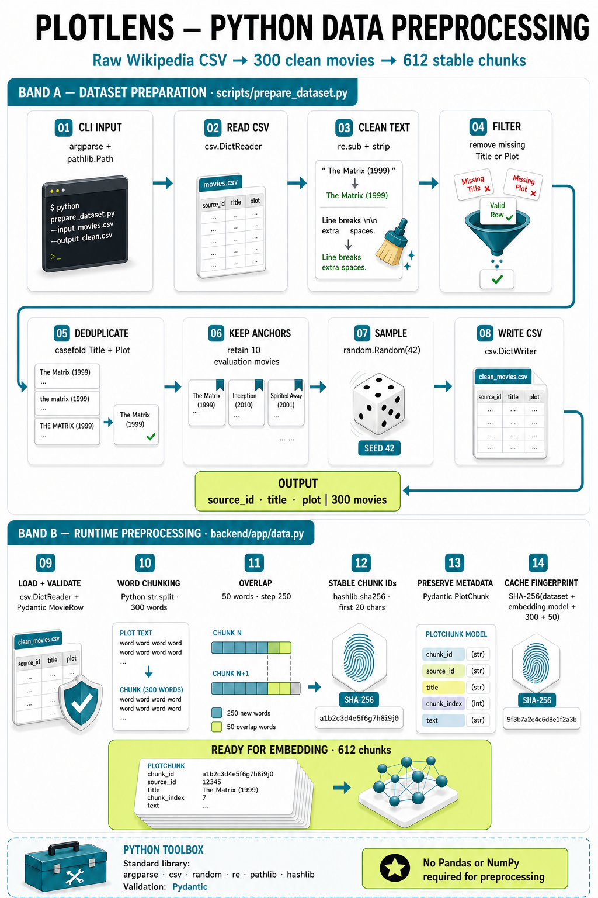
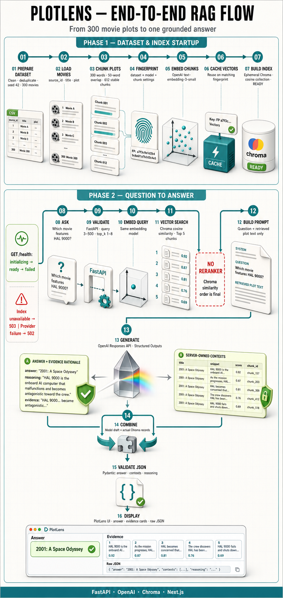
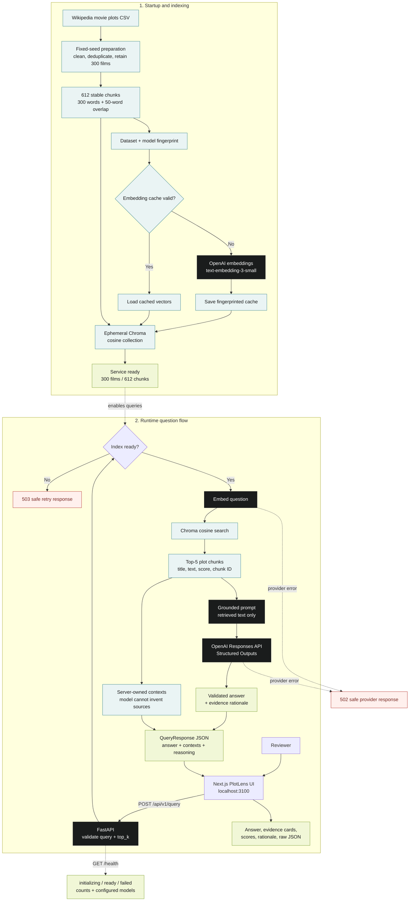

# PlotLens

**A compact, evidence-visible RAG system for Wikipedia movie plots.**

PlotLens connects a reproducible movie dataset to OpenAI embeddings, Chroma retrieval, and an OpenAI language model. Every answer is returned as structured JSON and displayed beside the exact plot passages used to form it.


## Why this implementation

The assignment asks for a clear path from data → embeddings → retrieval → LLM → structured output. PlotLens keeps that path explicit:

- **300 real movie plots** from the specified Wikipedia Movie Plots dataset
- **300-word chunks with 50-word overlap** and stable IDs
- **OpenAI `text-embedding-3-small` embeddings**, generated in batches and cached by dataset/model fingerprint
- **Ephemeral Chroma cosine index**, rebuilt from the cache at startup
- **Top-5 semantic retrieval** with visible similarity scores
- **OpenAI Responses API Structured Outputs** for a validated answer and evidence rationale
- **Server-owned contexts**, so the model cannot invent which passages were retrieved
- **FastAPI + Next.js** with Docker and native run paths

## Data Architecture

### Dataset and reproducibility

`data/movies.csv` is a deterministic 300-row subset of [Wikipedia Movie Plots on Kaggle](https://www.kaggle.com/datasets/jrobischon/wikipedia-movie-plots), the source named in the assignment. The preparation step:

### Python preprocessing flow



Dataset preparation deliberately uses Python's standard library (`argparse`, `csv`, `random`, `re`, `pathlib`, and `hashlib`), while Pydantic validates `MovieRow` and `PlotChunk` records. Pandas and NumPy are not required for preprocessing.

1. keeps `Title` and `Plot`;
2. removes missing rows and exact title/plot duplicates;
3. retains ten demo/evaluation anchor films when present;
4. samples the remaining rows with seed `42`;
5. writes stable source IDs and UTF-8 CSV.

To reproduce it after downloading `wiki_movie_plots_deduped.csv`:

```powershell
python scripts/prepare_dataset.py C:\path\to\wiki_movie_plots_deduped.csv --output data\movies.csv --size 300 --seed 42
```

See [data/README.md](data/README.md) for provenance and reuse notes.

## RAG Architecture

### Full 16-step RAG lifecycle



The poster covers both index startup and the live query path. For a focused runtime-only view, open the [one-question query flow](docs/plotlens-query-flow.png). The runtime path deliberately splits after retrieval: the model generates only the grounded answer and short evidence rationale, while FastAPI attaches the real Chroma records as `contexts`. The branches merge into the validated response shown in the UI.

### Implementation flow



The backend builds the index in a FastAPI lifespan task. `/health` reports `initializing`, `ready`, or `failed`; queries fail closed with `503` until retrieval is ready. Provider failures become secret-safe `502` responses. The answer and evidence rationale come from the model, while `contexts` are attached from the actual Chroma results by the server.

## Quick start with Docker

Requirements: Docker Desktop and an OpenAI API key with access to the configured models.

```powershell
Copy-Item .env.example .env
# Add your OPENAI_API_KEY to .env
docker compose up --build
```

Open:

- UI: <http://localhost:3100>
- FastAPI docs: <http://localhost:8100/docs>
- Health: <http://localhost:8100/health>

The first startup embeds 612 chunks and may take a short while. Later starts reuse the fingerprinted embedding cache stored in a Docker volume.

## Native setup

### Backend

Python 3.11+ is required.

```powershell
python -m venv .venv
.\.venv\Scripts\Activate.ps1
python -m pip install -e "backend[dev]"
Copy-Item .env.example .env
# Add your OPENAI_API_KEY to .env
uvicorn app.main:app --app-dir backend --reload --port 8100
```

### Frontend

Node.js 20+ and pnpm are required.

```powershell
Set-Location frontend
pnpm install
pnpm dev
```

The frontend defaults to a same-origin development proxy at `/backend`. Setting `NEXT_PUBLIC_API_URL=http://localhost:8100` uses FastAPI directly; the backend permits only `FRONTEND_ORIGIN` through CORS.

The light interface takes visual cues from [Type B Digital](https://www.typeb.digital/)—DM Sans-style typography, neutral editorial layouts, teal accents, and restrained motion. The Type B mark appears only to frame this as a candidate take-home prototype; it does not imply that PlotLens is an official Type B product. The 3D RAG visualization is CSS-only, respects reduced-motion preferences, and adds no WebGL runtime dependency.

## API contract

`POST /api/v1/query`

```json
{
  "query": "Which movie features the HAL 9000 computer?",
  "top_k": 5
}
```

```json
{
  "answer": "The movie is 2001: A Space Odyssey.",
  "contexts": [
    {
      "title": "2001: A Space Odyssey",
      "snippet": "...the HAL 9000 computer...",
      "score": 0.91,
      "chunk_id": "..."
    }
  ],
  "reasoning": "The retrieved plot explicitly identifies HAL 9000."
}
```

Queries are trimmed and limited to 3–500 characters. `top_k` must be 1–8. Invalid requests return `422`, an unavailable index returns `503`, and safe provider failures return `502` without exposing credentials or stack traces.

The same flow is available without the UI:

```powershell
python -m app.cli "Which movie features the HAL 9000 computer?" --top-k 5
```

Run that command from `backend`, or set `PYTHONPATH=backend` from the repository root.

## Configuration

| Variable | Default | Purpose |
|---|---|---|
| `OPENAI_API_KEY` | — | Required server-side credential; never exposed to Next.js |
| `OPENAI_CHAT_MODEL` | `gpt-5.6-luna` | Structured answer generation model |
| `OPENAI_EMBEDDING_MODEL` | `text-embedding-3-small` | Document and query embedding model |
| `DATASET_PATH` | `data/movies.csv` | Prepared 300-movie subset |
| `EMBEDDING_CACHE_DIR` | `backend/.cache/embeddings` | Fingerprinted local cache |
| `FRONTEND_ORIGIN` | `http://localhost:3100` | Sole allowed CORS origin |
| `NEXT_PUBLIC_API_URL` | `/backend` when unset | Browser-visible API base URL |


## Quality and evaluation

```powershell
$env:PYTHONPATH='.'
.\.venv\Scripts\python.exe -m pytest backend\tests
.\.venv\Scripts\python.exe -m ruff check backend scripts
.\.venv\Scripts\python.exe -m mypy backend\app

Set-Location frontend
pnpm lint
pnpm typecheck
pnpm build
```

Current offline verification: **16 tests passed**; the optional live OpenAI test is skipped when no API key is present. Tests cover preprocessing, chunk overlap, stable IDs, cache invalidation, deterministic retrieval, API validation, readiness, safe provider failure, and secret-safe health output.

Retrieval evaluation: Recall@5 = 10/10 (100%)

```powershell
$env:PYTHONPATH='backend'
.\.venv\Scripts\python.exe -m app.evaluate --cases evals\retrieval_cases.json
```

The evaluation requires `OPENAI_API_KEY` because it intentionally measures the production embedding path. Record the printed score after running it; do not substitute a mocked score. The target is at least 80% Recall@5.

## Design trade-offs

- **Small, committed subset:** reproducible and reviewer-friendly; not a production corpus ingestion design.
- **Word chunking:** transparent and sufficient for this dataset; token-aware semantic splitting would suit a larger corpus.
- **In-memory Chroma:** matches the assignment and avoids infrastructure; the embedding cache prevents repeated API spend.
- **Single retrieval stage:** easy to reason about; reranking, hybrid search, chat history, and agents are intentionally excluded.
- **Visible evidence:** contexts come from Chroma rather than model output, reducing source fabrication.
- **Evidence rationale:** explains the supporting fact without requesting or exposing private model chain-of-thought.

## Video walkthrough

Loom: **Add the final public Loom URL here before submission.**

Use the timed [two-minute recording script](docs/loom-script.md) to cover the pipeline, one live query, visible evidence, JSON output, tests, and trade-offs without running over time.

## Repository map

```text
backend/       FastAPI, RAG services, OpenAI provider, Chroma, tests
frontend/      Next.js App Router interface
data/          Reproducible 300-movie subset and provenance
evals/         Human-written Recall@5 cases
scripts/       Dataset preparation
docs/          UI preview and Loom script
compose.yml    One-command local stack
```

## Security notes

- The OpenAI key stays in the backend environment.
- `.env`, caches, build outputs, and virtual environments are excluded from Git.
- API errors are deliberately generic; detailed exceptions remain server-side.
- Next.js is pinned to the patched 15.5 maintenance release line.

## License

Application code is available under the [MIT License](LICENSE). Dataset content retains its original Wikipedia/source licensing; see [data/README.md](data/README.md).
